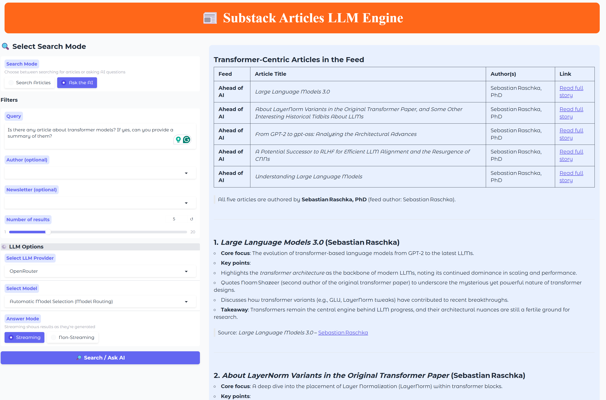

# Semantic Search Engine with RAG Pipeline

  <em>A production-grade RAG application for semantic search and LLM-powered Q&A over Substack newsletter content</em>

---

## 📚 Table of Contents

- [Overview](#-overview)
- [Tech Stack](#-tech-stack)
- [Features](#-features)
- [Prerequisites](#-prerequisites)
- [Getting Started](#-getting-started)
- [Services & Providers](#-services--providers)
- [License](#-license)

---

## 🧭 Overview

This project is a fully functional, end-to-end **Retrieval-Augmented Generation (RAG)** system built to ingest, index, and search content from Substack newsletters. It supports both keyword and semantic (vector) search, with an LLM-powered Q&A layer on top, deployed via Google Cloud Run and accessible through a Gradio UI and REST API.

---

## 🛠 Tech Stack

| Layer | Technology |
|---|---|
| Database | Supabase (PostgreSQL) |
| Vector Store | Qdrant (hybrid search + quantization) |
| Orchestration | Prefect |
| Backend API | FastAPI |
| LLM Providers | OpenRouter, OpenAI, Hugging Face |
| Frontend UI | Gradio |
| Deployment | Google Cloud Run + Docker |
| Evaluation | Opik AI |

---

## ✨ Features

- Ingest articles from RSS feeds and store them in Supabase PostgreSQL
- Generate and index vector embeddings in Qdrant with hybrid search (keyword + semantic) and quantization
- Orchestrate and schedule ingestion workflows with Prefect (local and cloud)
- Expose RESTful search endpoints via FastAPI
- Support multiple LLM providers: OpenRouter, OpenAI, and Hugging Face
- Deploy backend to Google Cloud Run for scalable, global access
- Interactive Gradio UI for end-users

---

## 🎓 Prerequisites

- Python (Intermediate)
- Basic understanding of REST APIs
- Familiarity with AI/LLM concepts is helpful
- Modern laptop/PC — no GPU required; free tiers are sufficient for all services

---

## 🚀 Getting Started

Follow the [INSTRUCTIONS.md](INSTRUCTIONS.md) to set up your environment, install dependencies, and configure all services.

> All free tiers (Supabase, Qdrant, Prefect Cloud, Google Cloud Run, OpenRouter) are sufficient to run this project end-to-end at no cost.

---

## 🔌 Services & Providers

| Service | Purpose | Docs |
|---|---|---|
| Supabase | PostgreSQL database for articles | [Docs](https://supabase.com/docs) |
| Qdrant | Vector DB for embeddings & hybrid search | [Docs](https://qdrant.tech/documentation/) |
| Prefect | Workflow orchestration | [Docs](https://docs.prefect.io/) |
| OpenRouter | Primary LLM provider | [Docs](https://www.openrouter.com/) |
| OpenAI / Hugging Face | Backup LLM providers | [OpenAI](https://platform.openai.com/docs/) / [HF](https://huggingface.co/docs) |
| FastAPI | Search & query API | [Docs](https://fastapi.tiangolo.com/) |
| Docker | Containerization | [Docs](https://docs.docker.com/) |
| Google Cloud SDK | Cloud CLI | [Docs](https://cloud.google.com/sdk/docs) |
| Google Cloud Run | Deployment & hosting | [Docs](https://cloud.google.com/run/docs) |
| Gradio | Frontend UI | [Docs](https://gradio.app/get_started) |
| Opik AI | LLM evaluation | [Docs](https://opik.ai/) |

---

## 🪪 License

This project is licensed under the MIT License — see the [LICENSE](LICENSE) file for details.
